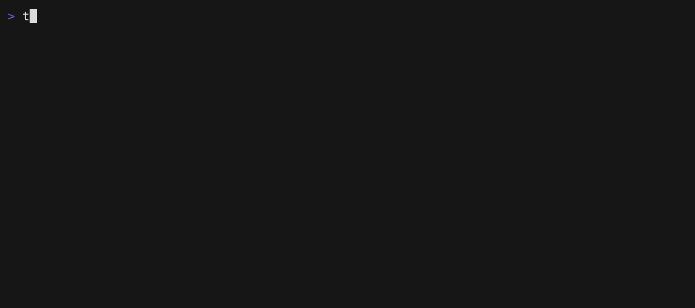

# tfx

A terminal UI for exploring Terraform state files, inspired by [fx](https://github.com/antonmedv/fx).



## Usage

```bash
# From terraform output
terraform show -json | tfx

# From saved state file
terraform show -json > state.json
tfx -in state.json
```

## Features

-   🌳 Interactive tree navigation of Terraform state
-   🔍 Expand/collapse resources and modules
-   🎨 Syntax highlighting for different value types
-   🔒 Sensitive value protection
-   ⌨️ Vim-style keybindings (`hjkl`, `?` for help)

Navigate with arrow keys or vim bindings, press `?` for help, `q` to quit.
